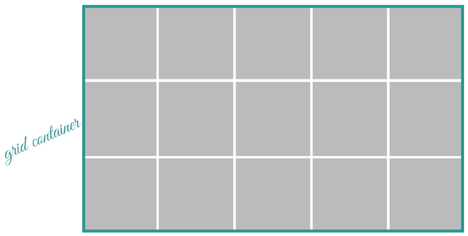
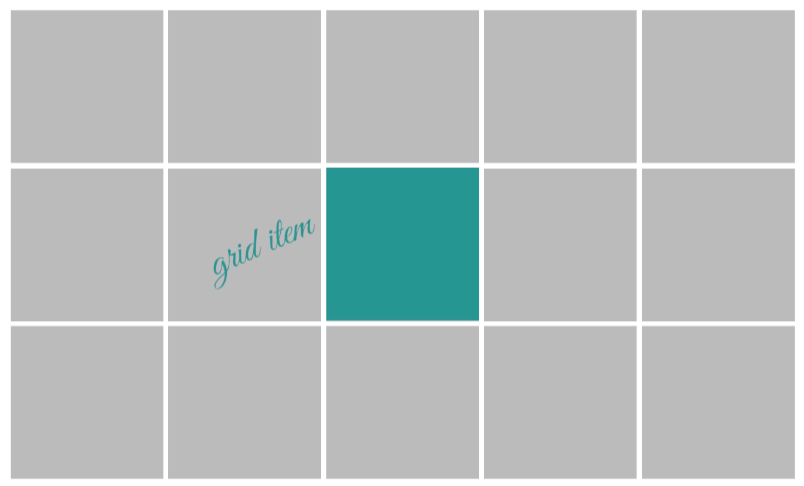
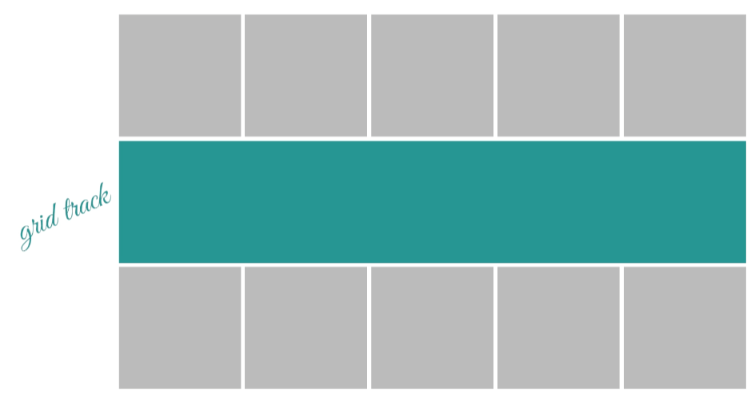
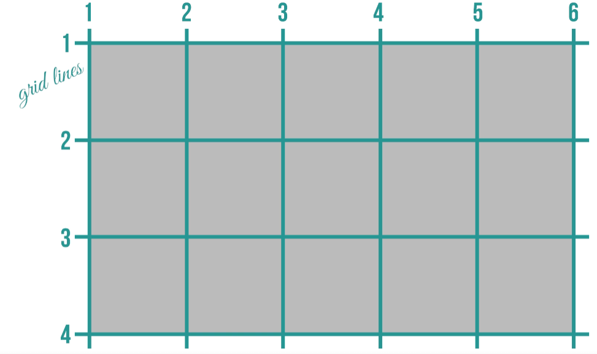
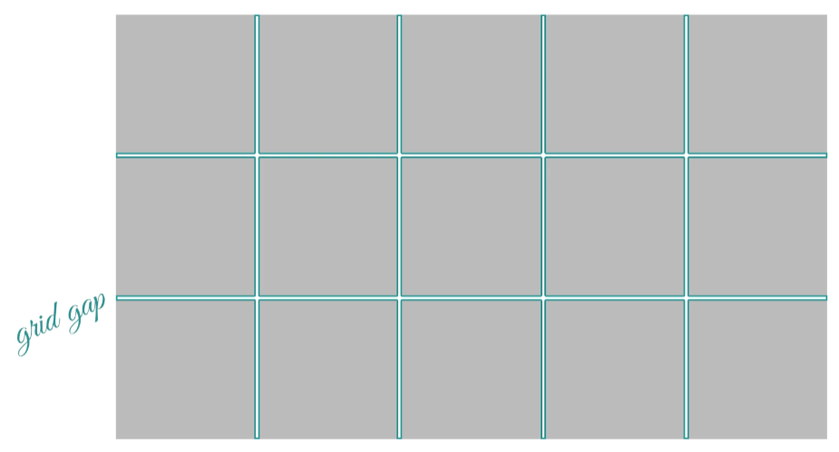

# Terminologias CSS Grid
#### Terminologias usadas com o CSS Grid.
 

## Grid Container  
#### O Grid Container é o espaço onde o grid é definido.
 

 

## Grid Item ou Célula de Grid
#### Dentro do grid container cada bloco é chamado de grid item.

 

## Grid Track
#### Uma linha ou uma coluna em seu todo chama-se grid track, existem as duas nomeclaturas auxiliares.

1. column-track - para colunas
2. row-track - para linhas

#### porém todas no fundo são tratadas como grid track.

 

## Gride Lines
#### As linhas do grid podem ser tantos verticais quanto horizontais todas possuem a sua propria numeração.

 

## Gride Area
#### Quando se pega mais de uma célula de grid temos uma grid area tanto faz o tamanho.

 

## Grid Gap
#### Os espaços entres as células são chamados de gaps

  

---
 
Contéudo retirado do curso de CSS grid da udemy
https://www.udemy.com/course/css-grid-layout/ 
Author: Tárcio Zemel